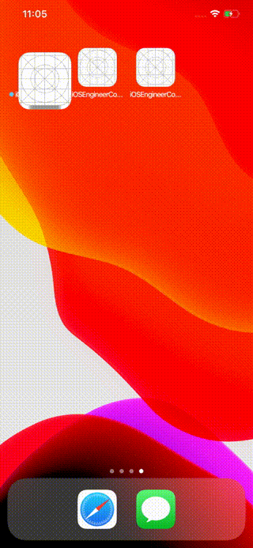

# GitHub リポジトリ検索アプリ(お題作成: 株式会社ゆめみさん)
## はじめに
* **本リポジトリは[yumemi-inc/ios-engineer-codecheck] をベースに、アレンジを加えたものとなります**
* アプリ改良のマイルストーン
    * [完了](https://github.com/tshion/yumemi-inc_ios-engineer-codecheck/milestones?direction=asc&sort=title&state=closed)
    * [進行中](https://github.com/tshion/yumemi-inc_ios-engineer-codecheck/milestones?direction=asc&sort=title&state=open)

※個人的な勉強が目的のため、状況設定を追加しました

* アプリは他のIT 企業によってリリースされているが、大人の事情で、私が所属する企業がアプリを引き継ぐことになった
* アプリの発注元はプロダクト改良に積極的で、技術面の改良は我々に一任されており、さらに予算もついている
    * 補足: もし消極的だった場合、予算と睨めっこしながらバグフィックスをこなす話となってしまうので、本リポジトリではその制限を設けない
* 前述の条件のため、アプリの改良はチームを組んで対応することになったので、タスク管理を行う必要がある

## アプリについて
GitHub リポジトリを検索できるiOS アプリ。

| 1.0.x |
| :---: |
|  |

※アプリを試したい場合は、`released` ブランチのものをローカルでビルドしてください

## もしアプリ開発をやってみたくなったら
下記を参照してください。

* [CONTRIBUTING](./docs/CONTRIBUTING.md)
    * 開発環境について
    * 開発作業の流れ
    * レビュー方針
    * リリースの流れ
    * 備考
* [先方からの要求事項](https://github.com/tshion/yumemi-inc_android-engineer-codecheck/blob/develop/docs/Requirements.md) (※別サイト)
    * アプリの使い方
    * システム関連
* [仕様メモ](https://github.com/tshion/yumemi-inc_android-engineer-codecheck/blob/develop/docs/SpecNotes.md) (※別サイト)
    * アプリ関連
        * 画面構成とデザイン
        * データの取り扱い方針
        * バージョニング
        * ログの取り扱い方針
    * 外部システム関連
        * GitHub REST API
        * クラッシュ分析ツール
    * 備考
        * データセーフティ
* 設計メモ
    * TODO
* 各パッケージのREADME
    * TODO

## 関連リンク
* 複製元リポジトリ: [yumemi-inc/ios-engineer-codecheck]
    * [複製時点のREADME](./docs/README.original.md)
* [Android 版の開発リポジトリ](https://github.com/tshion/yumemi-inc_android-engineer-codecheck)

[yumemi-inc/ios-engineer-codecheck]: https://github.com/yumemi-inc/ios-engineer-codecheck/commit/121f618f0b82eac3318621dd46bc13382e8c31b7
